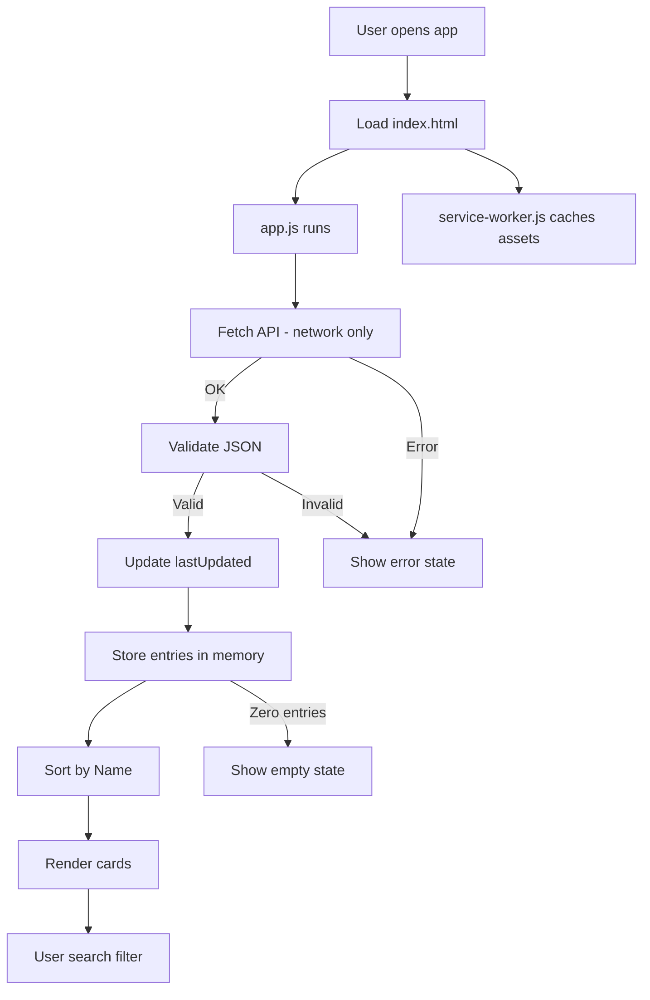

# School Closings Web App

Single-page web app hosted on GitHub Pages that displays school closings and delays pulled from the Cardinal Driving API. The UI is a lightweight PWA with offline-friendly asset caching.

## Live data source

API endpoint:
```
https://yr4zm4dy27.execute-api.us-east-1.amazonaws.com/Prod/
```

Expected JSON:
```json
{
  "lastUpdated": "01/27/2026 10:30:45",
  "entries": [
    {
      "Name": "Gengras School",
      "Status": "Closed",
      "UpdateTime": "Updated 10:15 AM",
      "Source": "NBC Connecticut"
    }
  ]
}
```

## How it works (detail)

1) `index.html` renders the layout: header, refresh button, search input, and containers for loading/empty/error states.
2) `app.js` starts by fetching the API on page load, then every 15 minutes, and also on manual refresh.
3) The response is validated (`entries` must be an array). The `lastUpdated` value is displayed in the header.
4) All entries are stored in memory and rendered into cards, sorted alphabetically by `Name`.
5) The search bar filters entries by `Name` or `Status` (case-insensitive).
6) The UI switches between loading, empty, and error states depending on API results.
7) `service-worker.js` caches static assets for fast loads/offline. API calls bypass the cache and always hit the network.

## Mermaid flow chart



## Files and roles

- `index.html` - Static markup and page structure.
- `styles.css` - Visual design for layout, cards, and states.
- `app.js` - Fetching, filtering, rendering, and UI state logic.
- `service-worker.js` - Cache-first for assets, network-only for API.
- `manifest.json` - PWA metadata (name, icons, theme color).

## Caching behavior (service worker)

- Assets are cached on install for faster reloads and offline use.
- API requests to `execute-api.amazonaws.com` are never cached.
- On deploy, bump cache to force new assets:
  - Update `CACHE_NAME` in `service-worker.js`
  - (Optional) bump query string in `index.html` for CSS/JS (e.g., `styles.css?v=13`)

## Local usage

Open `index.html` in a browser or serve the folder with any static server.

## Deployment (GitHub Pages)

Push changes to `main`. GitHub Pages serves the latest build automatically.

## AWS / API backend notes

This repo only contains the web app. The API and its AWS resources are not defined here, but the app expects:

- API Gateway endpoint at `https://yr4zm4dy27.execute-api.us-east-1.amazonaws.com/Prod/`
- Backend that returns the JSON shape shown above

If you want the README to include exact AWS configuration (API Gateway setup, IAM roles/policies, S3 buckets, or Lambda details), point me to the repo or document that defines those resources and I will add it precisely.

## GitHub Pages configuration

This project is a static site. Typical setup:

- Branch: `main`
- Folder: `/ (root)`
- Custom domain: optional (not defined in this repo)

If your Pages settings differ, tell me the exact values and I will document them.

## Troubleshooting

- **No data**: API may be returning an empty `entries` array.
- **Fetch errors**: Check API availability and browser console.
- **Old assets**: Ensure `CACHE_NAME` is incremented after changes.
